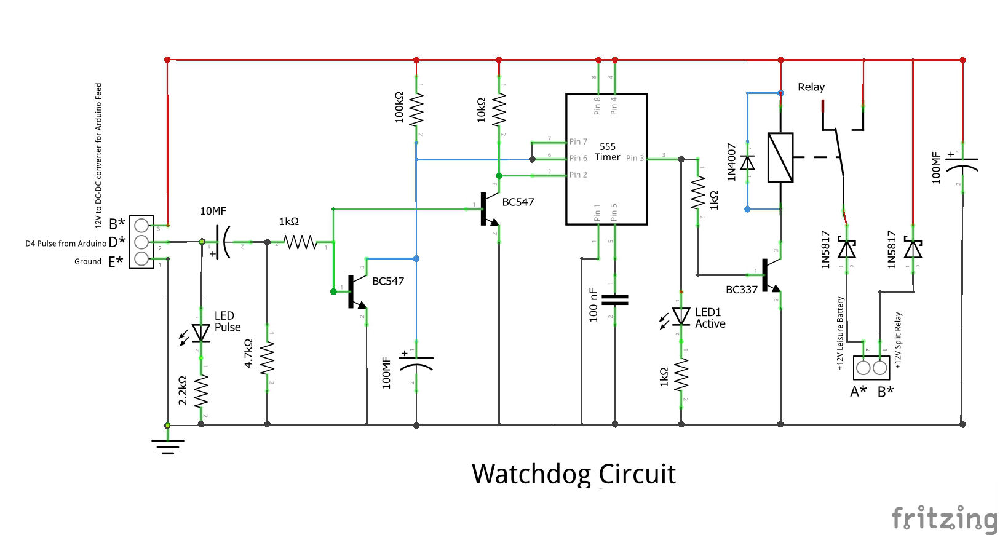

# 🩺 Technical Deep-Dive: The NE555 Watchdog Failsafe

The most critical safety feature of the **T5-BMS** is the hardware Watchdog circuit. In a vehicle environment, electromagnetic interference (EMI) or software hangs can cause a microcontroller to "freeze." If the Nano freezes while the 40A relay is closed, it could lead to a permanent connection that flattens your starter battery.

This circuit ensures that **physical hardware**—not just software—monitors the system's health.

---

## 1. The Heartbeat Logic (Arduino Nano)
The Arduino Nano is programmed to send a **1Hz Pulse** (1 heartbeat per second) from Pin D4. This pulse is the "Keep Alive" signal for the entire system.

### 🔭 Pulse Analysis
The following oscilloscope trace shows the raw signal leaving the Arduino. It is a precise **10ms wide pulse** sent every **1000ms**.

  
   <em>Figure 1: Raw 1Hz Heartbeat Signal from Arduino Nano (Pin D4)</em>

---

## 2. The Differentiator (AC Coupling)
To prevent a "false positive" (where the Nano freezes with the LED stuck **ON**), the signal passes through a **Differentiator Circuit** (a Capacitor and Resistor combination).

* **How it works:** A capacitor blocks steady DC voltage. It only allows the *transition* (the rising and falling edges) to pass through.
* **The Result:** Even if the Nano freezes with the pin "High," the capacitor will block the signal, and the heartbeat will flatline.

  
   <em>Figure 2: Signal after the Capacitor, showing only the sharp 'spikes' allowed to pass.</em>

---

## 3. Missing Pulse Detection (NE555 Monostable)
The heart of the watchdog is an **NE555 Timer** configured in **Monostable Mode** (a "one-shot" timer).

### The "Reset" Mechanism
Normally, a monostable timer starts a countdown and turns off. However, in this circuit, each pulse from the Nano triggers a **BC547 transistor** that momentarily shorts the timing capacitor of the 555. 

* **Pulse Present:** Every second, the "clock" is reset to zero before it can finish its countdown. The relay stays **ON**.
* **Pulse Missing:** If the Nano freezes or the engine stops, the "reset" stops. The 555 finishes its countdown and opens the relay.

### 🔬 Timing Capacitor Charge Cycle
In the traces below, you can see the 555's timing capacitor attempting to charge up to its threshold. 

| **Normal Operation (Pulse Present)** | **Fail Event (Pulse Missing)** |
| :--- | :--- |
|  |  |
| Each "sawtooth" represents a heartbeat resetting the timer. | Without a pulse, the voltage reaches the limit, triggering a shutdown. |

---

## 4. Dual-Transistor Stability
To ensure industrial-grade reliability, the circuit uses two separate **BC547** transistors:

1. **Trigger Transistor:** Stabilizes the input signal to ensure the 555 triggers reliably on the very first pulse when the engine starts.
2. **Discharge Transistor:** Responsibly shorts the timing capacitor to "kick" the timer back to the start of its 30-second window.

---

## 🛠️ Watchdog Schematic
Refer to the official Fritzing schematic for component values (100kΩ / 100µF combination determines the 30-second "Safety Window").

  

---

<small>© 2026 MatsRobot | Licensed under the [MIT License](https://github.com/MatsRobot/matsrobot.github.io/blob/main/LICENSE)</small>